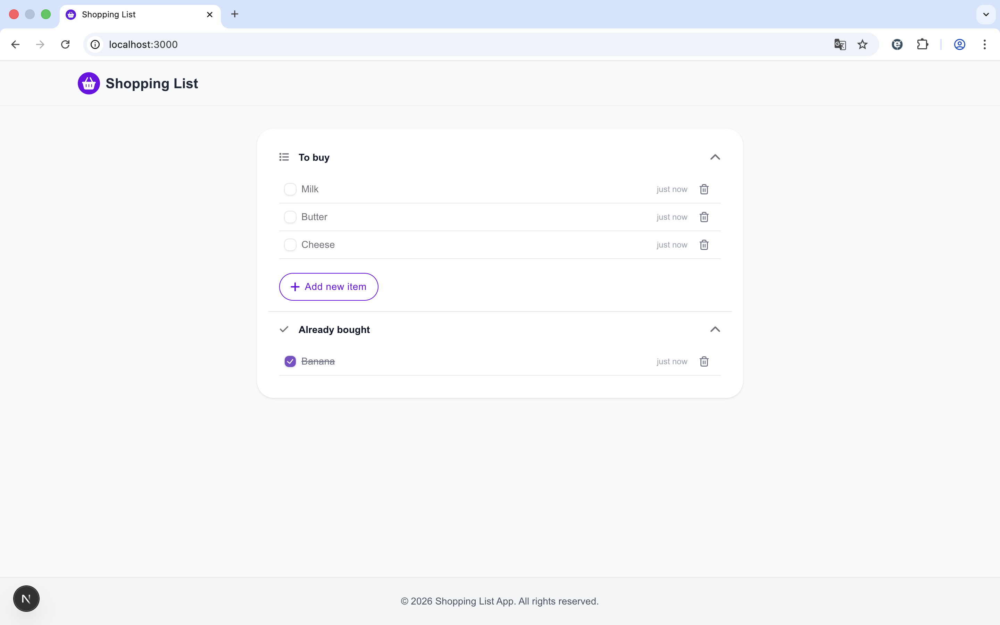
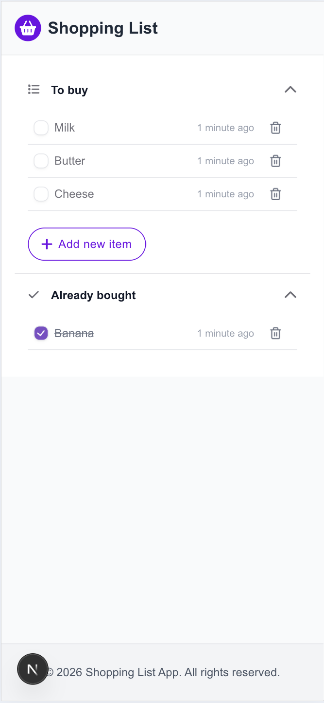

# shopping_list_app

   
   

### Tech stack
## frontend
- **Framework:** Next.js, React, TypeScript
- **Styling:** Tailwind CSS
- **UI library:** HeroUI

## backend
- **server:** Node.js, Express, TypeScript
- **database:** MongoDB, Mongoose

### Setup
Follow these steps to run the application locally.

### 1. Clone & Install
- git clone [https://github.com/EmanuelSchweizer/shopping_list_app.git](https://github.com/EmanuelSchweizer/shopping_list_app.git)
- cd shopping_list_app

### 2. Install dependencies
- cd backend
- npm install
- cd ../frontend
- npm install

### 3. Configure backend
- Create a backend/.env file based on backend/.env.example
- Set MONGO_URI to your MongoDB Atlas connection string
- Set PORT e.g. 5001
- Optional admin bootstrap variables (used only when no user exists yet):
   - ADMIN_NAME e.g. Admin
   - ADMIN_EMAIL e.g. admin@example.com
   - ADMIN_PASSWORD e.g. admin123

### 4. Configure frontend
- Create a frontend/.env file based on frontend/.env.example
- Set API_URL to your backend URL e.g. http://localhost:5001

### 5. Start MongoDB
- Make sure your Atlas cluster is running and your IP is allowed in Atlas Network Access.

### 6. Run the app
Backend:
- cd backend
- npm run dev

Frontend:
- cd frontend
- npm run dev

### Database initialization
When the backend starts, initial data is created automatically.

- If the collection is empty, three default items are created: Milch, Brot, Eier.
- If the user collection is empty, initial roles (admin, user) are created and one admin user is inserted.
- If data already exists, nothing is overwritten or inserted twice.

### Backend endpoints
- GET /items

- POST /items
   Body: { "name": string }

- PUT /items/:id updates the bought status of an item.
   Body: { "bought": boolean }
   
- DELETE /items/:id deletes an item.

