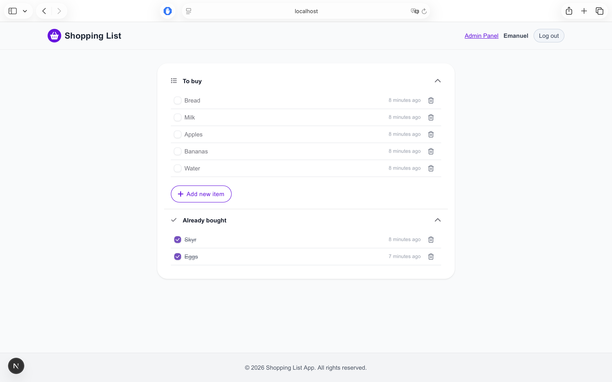
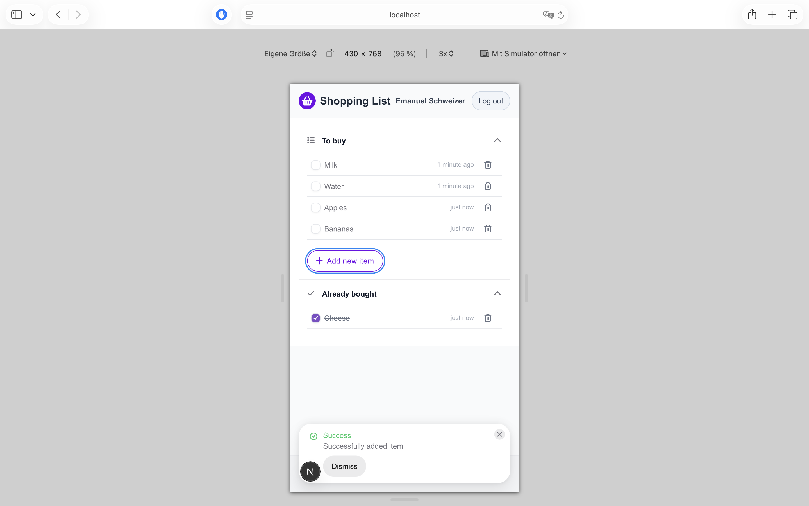
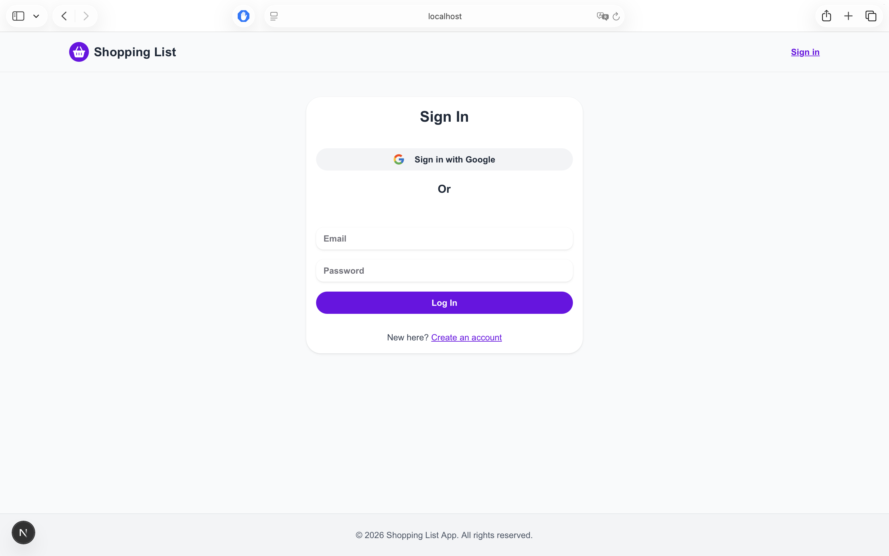
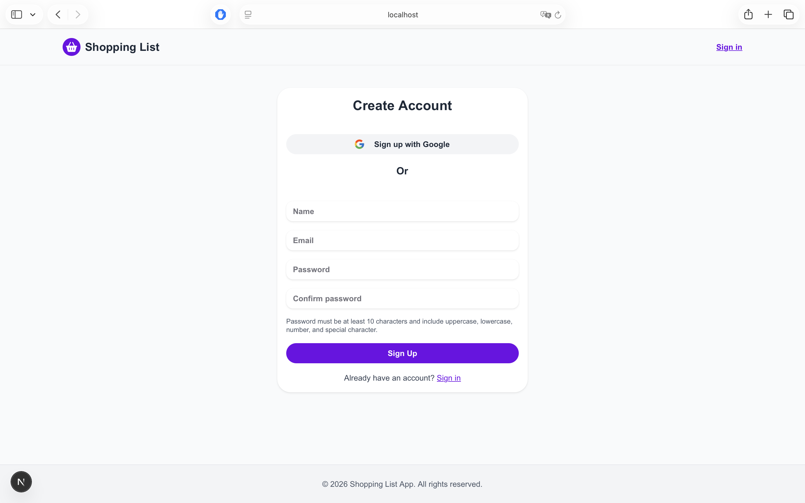
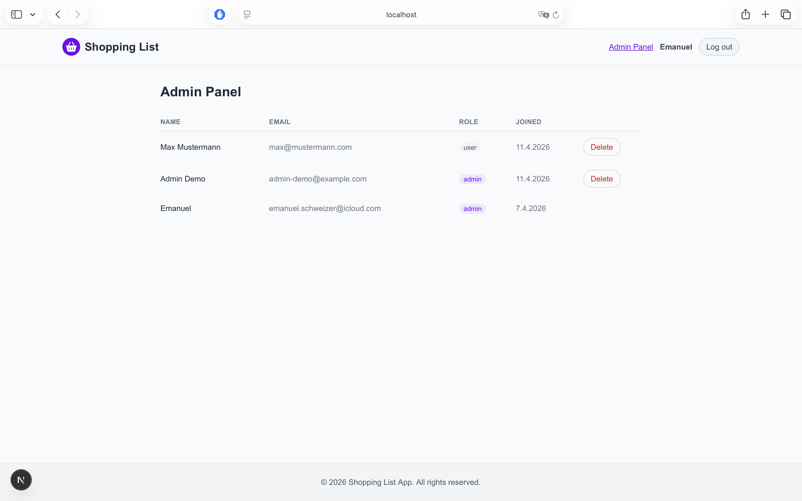

# Full-Stack Auth System with User Management

## Overview
Full-stack web application demonstrating OAuth2 authentication, user management, and role-based access.

## Key Features

- Google OAuth & Email/Password authentication
- JWT-based authentication & session management
- Role-based access control (admin/user)
- Admin panel for user management
- Read-only demo admin account
- REST API with authentication & authorization
- Deployed via Vercel

## Tech Stack

## Frontend
- **Framework:** Next.js, React, TypeScript
- **Styling:** Tailwind CSS
- **UI library:** HeroUI

## Backend
- **server:** Node.js, Express, TypeScript
- **database:** MongoDB, Mongoose

## Live Demo

👉 [https://auth-demo-app-frontend.vercel.app](https://auth-demo-app-frontend.vercel.app)

Demo Account:
- Email: admin-demo@example.com
- Password: demoadmin123

### Screenshots

### Backend API (Overview)

The backend provides REST endpoints for authentication, user management, and item handling.

Main endpoints include:

- Auth: signup, login, OAuth user resolution
- Items: CRUD operations
- Admin: user management (admin only)

